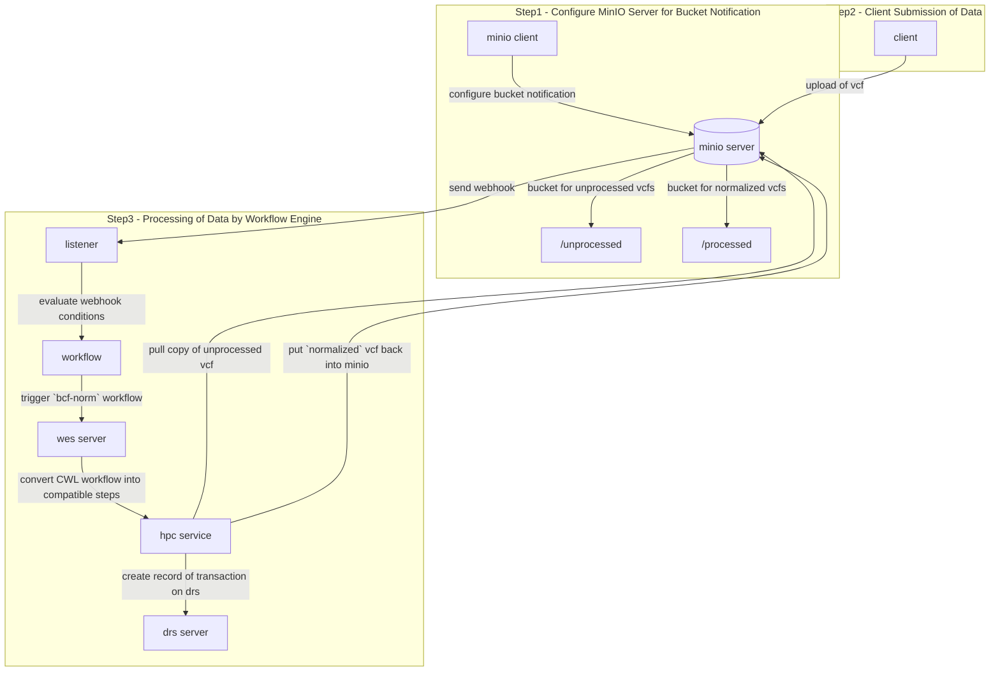

# Normalize on Ingest Project Plan

## Overview

## Workflow

```mermaid
graph TB
  subgraph Step1 - Configure MinIO Server for Bucket Notification
    mc[minio client] -->|configure bucket notification| ms[(minio server)]
    ms -->|bucket for unprocessed vcfs| b1["/unprocessed"]
    ms -->|bucket for normalized vcfs| b2["/processed"]
  end
  subgraph Step2 - Client Submission of Data
    cl[client] -->|upload of vcf| ms
  end
  subgraph Step3 - Processing of Data by Workflow Engine
    ms -->|send webhook| ls[listener]
    ls -->|evaluate webhook conditions| wf[workflow]
    wf -->|trigger `bcf-norm` workflow| wes[wes server]
    wes -->|convert CWL workflow into compatible steps| hpc[hpc service]
    hpc -->|pull copy of unprocessed vcf| ms
    hpc -->|put `normalized` vcf back into minio| ms
    hpc -->|create record of transaction on drs| drs[drs server]
  end

```

## Task list

## Gantt Chart

```mermaid
gantt
title Project Timeline
dateFormat YYYY-MM-DD

section Minimal Viable Product

```
