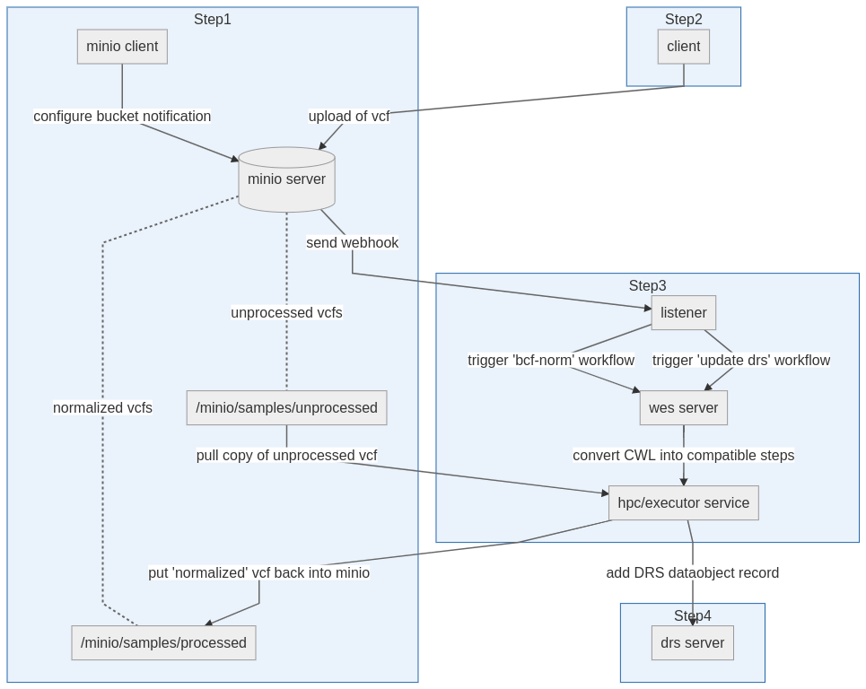
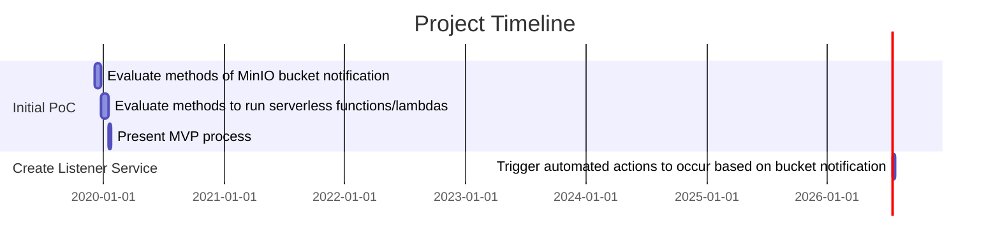

# Normalize on Ingest Project Plan

## Overview

## Workflow

## Task list

- [✓] Evaluate methods of MinIO bucket notification
- [✓] Create PoC of MinIO webhooks
- [✓] Build listener service to receive bucket notification
- [✓] Use notification to trigger workflow
- [ ] Create a normalization CWL workflow
  - [ ] Use inputs from S3/MinIO
  - [ ] Run  htsfile  to retrieve sample
  - [ ] Run  bcftools norm  on  file.vcf.gz
  - [ ] Run  mc cp  to put processed file into minio/samples/processed/file.vcf
- [✓] Create demo presentation
  - [✓] Run  docker-compose
  - [✓] Setup buckets
  - [✓] Enable debugging for services
  - [✓] Add sample files
  - [✓] Ingest should run successful pipeline
  - [✓] diff the output between two files
- [ ] Expand PoC with DRS
- [ ] Add ability to run workflow over WES

## Gantt Chart

